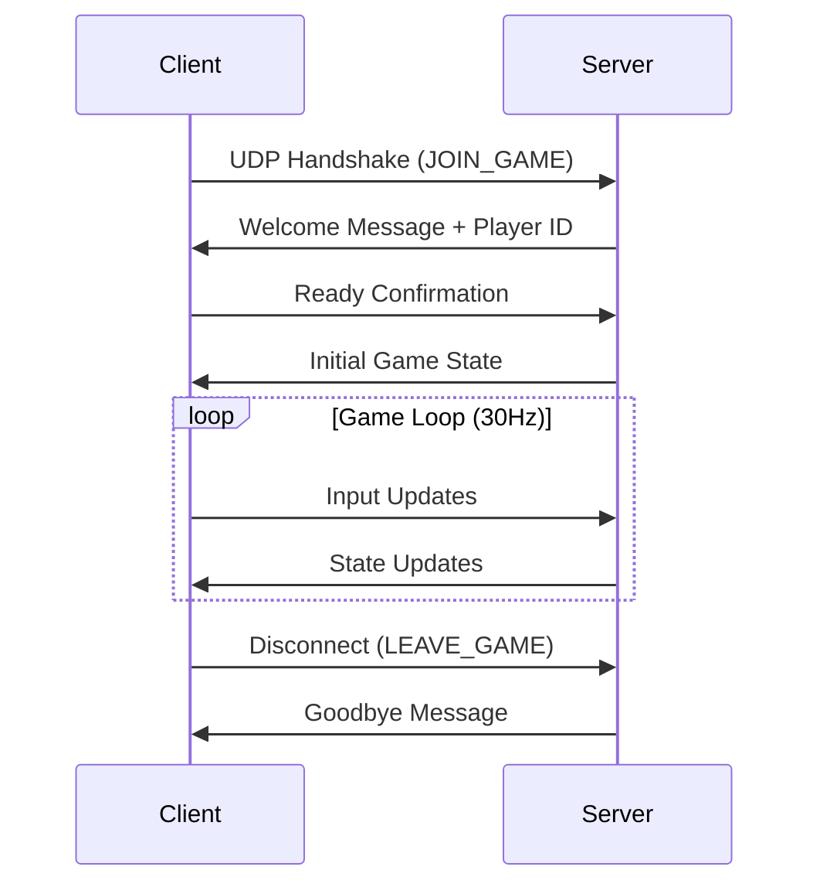

# Pirate Game Protocol Specification

## Overview

The Pirate Game uses a client-server architecture with UDP for game traffic and HTTP/WebSocket for real-time communication. The server runs at 30Hz physics simulation and sends state updates to clients.

---

## Connection Protocol

### Initial Connection Flow



### Connection Establishment

1. **Client Handshake**: Client sends JOIN_GAME packet to server UDP port 8080
2. **Server Response**: Server assigns player ID and sends welcome packet
3. **State Sync**: Server sends full game state snapshot
4. **Game Loop**: Continuous input/state update cycle begins

---

## Transport Layer

### UDP Game Traffic (Port 8080)
- **Protocol**: UDP with custom reliability layer
- **Packet Size**: Maximum 1400 bytes (safe for internet MTU)
- **Frequency**: 30Hz server updates, client input as-needed
- **Ordering**: Sequence numbers for critical messages
- **Reliability**: Custom ACK system for important packets

### HTTP Admin Interface (Port 8081)
- **Protocol**: HTTP/1.1 
- **Purpose**: Server monitoring and administration
- **Endpoints**: REST API + WebSocket for live updates

---

## Message Format

### Packet Structure
```c
struct GamePacket {
    uint32_t magic;         // 0x50495241 ('PIRA')
    uint16_t version;       // Protocol version (1)
    uint16_t type;          // Message type
    uint32_t sequence;      // Sequence number
    uint32_t timestamp;     // Client timestamp (ms)
    uint16_t payload_size;  // Payload length in bytes
    uint8_t  checksum;      // Simple checksum
    uint8_t  flags;         // Packet flags
    // Payload follows...
};
```

### Message Types

#### Client → Server Messages

| Type | Value | Description |
|------|-------|-------------|
| `JOIN_GAME` | 0x01 | Initial connection request |
| `INPUT_UPDATE` | 0x02 | Player input state |
| `PING` | 0x03 | Keepalive/latency measurement |
| `LEAVE_GAME` | 0x04 | Graceful disconnect |
| `CHAT_MESSAGE` | 0x05 | Player chat |

#### Server → Client Messages

| Type | Value | Description |
|------|-------|-------------|
| `WELCOME` | 0x81 | Connection accepted + Player ID |
| `GAME_STATE` | 0x82 | Full world state snapshot |
| `STATE_UPDATE` | 0x83 | Incremental state changes |
| `PLAYER_JOINED` | 0x84 | New player notification |
| `PLAYER_LEFT` | 0x85 | Player disconnect notification |
| `PONG` | 0x86 | Ping response |
| `ERROR` | 0x87 | Error notification |

---

## Data Formats

### Coordinate System
- **Fixed-Point Math**: Q16.16 format (32-bit: 16 integer, 16 fractional)
- **World Bounds**: -4096.0 to +4096.0 units
- **Conversion**: `float_val = fixed_val / 65536.0`

### Vector2 (Position/Velocity)
```c
struct Vec2Fixed {
    int32_t x;  // Q16.16 fixed-point
    int32_t y;  // Q16.16 fixed-point
};
```

### Player Input State
```c
struct InputState {
    uint8_t keys;           // Bitmask: W=1, A=2, S=4, D=8
    uint8_t mouse_buttons;  // Left=1, Right=2, Middle=4
    int16_t mouse_x;        // Screen-relative mouse X
    int16_t mouse_y;        // Screen-relative mouse Y
    uint32_t timestamp;     // Client timestamp
};
```

### Ship State
```c
struct ShipState {
    uint32_t ship_id;
    struct Vec2Fixed position;
    struct Vec2Fixed velocity;
    int32_t rotation;       // Q16.16 radians
    int32_t angular_vel;    // Q16.16 radians/second
    uint16_t hull_hp;
    uint8_t  module_count;
    // Module data follows...
};
```

### Projectile State
```c
struct ProjectileState {
    uint32_t projectile_id;
    struct Vec2Fixed position;
    struct Vec2Fixed velocity;
    uint16_t damage;
    uint8_t  type;          // Cannonball=1, Chain=2, etc.
    uint8_t  ttl;           // Time to live (ticks)
};
```

---

## Message Payloads

### JOIN_GAME (Client → Server)
```json
{
    "player_name": "BlackBeard",
    "client_version": "1.0.0",
    "preferred_ship": "sloop"
}
```

### WELCOME (Server → Client)
```json
{
    "player_id": 12345,
    "assigned_ship_id": 67890,
    "world_seed": 1234567890,
    "server_time": 9876543210,
    "tick_rate": 30
}
```

### INPUT_UPDATE (Client → Server)
```c
struct InputPayload {
    uint32_t player_id;
    struct InputState input;
    uint32_t client_tick;   // Client prediction tick
};
```

### GAME_STATE (Server → Client)
```c
struct GameStatePayload {
    uint32_t server_tick;
    uint32_t server_time;
    uint16_t ship_count;
    uint16_t projectile_count;
    uint16_t player_count;
    // Ship states follow...
    // Projectile states follow...
    // Player states follow...
};
```

### STATE_UPDATE (Server → Client) 
Incremental updates using delta compression:
```c
struct StateUpdatePayload {
    uint32_t server_tick;
    uint32_t base_tick;     // Reference tick for delta
    uint16_t changed_ships; // Bitmask of changed ship IDs
    uint16_t new_projectiles;
    uint16_t destroyed_projectiles;
    // Only changed data follows...
};
```

---

## Network Optimization

### Delta Compression
- Server tracks last acknowledged state per client
- Only sends changes since last ACK
- Fallback to full snapshot if delta too large

### Prediction & Lag Compensation
- **Client Prediction**: Apply inputs immediately for responsiveness
- **Server Reconciliation**: Correct client state with authoritative updates
- **Lag Compensation**: Server rewinds time for hit validation
- **Interpolation**: Smooth movement between server updates

### Bandwidth Management
- **Priority System**: Critical updates (damage) sent reliably
- **Culling**: Only send nearby entities to each client
- **Compression**: Bit-packing for frequently sent data
- **Rate Limiting**: Throttle non-essential updates under load

---

## Error Handling

### Packet Loss
- Reliable channel for critical messages (using ACKs)
- Sequence numbers detect dropped packets  
- Automatic resend with exponential backoff
- Timeout and disconnect after 5 seconds without response

### Desynchronization
- Server sends periodic full snapshots (every 2 seconds)
- Client validates state consistency
- Automatic resync if deviation detected
- Rollback and replay for mispredictions

### Cheating Prevention
- Server is authoritative for all physics
- Input validation (speed limits, cooldowns)
- Sanity checks on client predictions
- Immediate disconnect for impossible actions

---

## Performance Targets

| Metric | Target | Notes |
|--------|--------|-------|
| **Tick Rate** | 30 Hz | Server physics simulation |
| **Update Rate** | 20-30 Hz | Client state updates |
| **Latency** | <100ms | Acceptable for real-time gameplay |
| **Bandwidth** | <50 KB/s per player | Including overhead |
| **Players** | 32 maximum | Current server capacity |
| **Packet Loss** | <5% tolerance | Graceful degradation |

---

## Implementation Notes

### Server (C)
- Uses `struct sockaddr_in` for UDP addressing
- Fixed-point arithmetic throughout simulation
- Memory pools for packet allocation
- Lock-free queues for thread safety

### Client (TypeScript/Browser)
- WebRTC DataChannel or WebSocket fallback
- JavaScript Float64 converted to/from fixed-point
- Prediction engine with rollback capability
- Interpolation using cubic splines

### Testing
- Packet loss simulation via `tc` (Linux traffic control)
- Latency injection for lag testing
- Load testing with bot clients
- Cross-platform compatibility verification

---

This specification ensures deterministic, responsive, and scalable multiplayer gameplay for the pirate ship physics game.